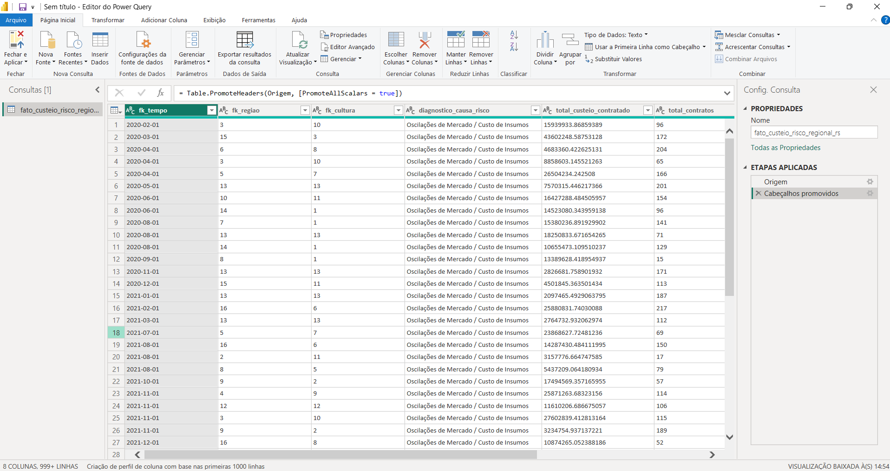
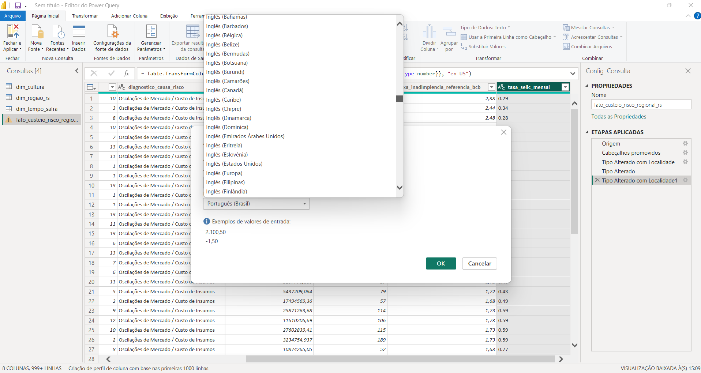
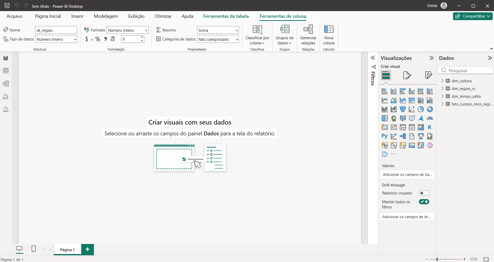
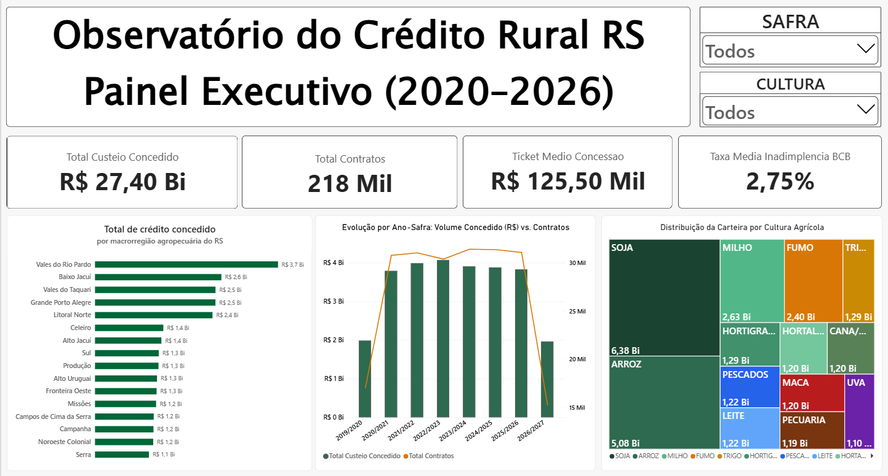
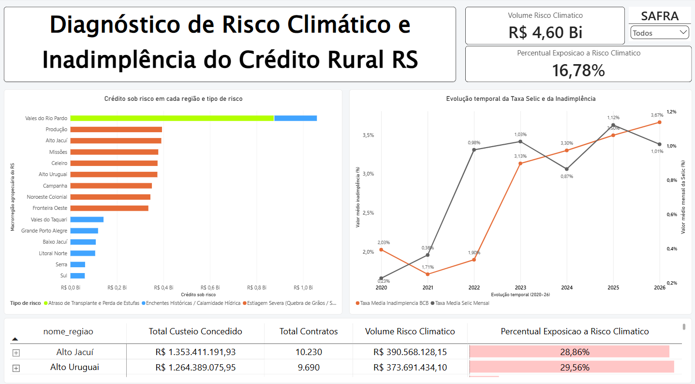

# 🌾 Observatório e Análise de Risco do Crédito Rural no RS

**Safras 2019/2020 a 2026/2027 | Dados de 2026 parciais**

[](https://databricks.com/)
[](https://spark.apache.org/)
[](https://delta.io/)
[](https://powerbi.microsoft.com/)
[](https://python.org)

## Navegação

[Fluxo do projeto](#-fluxo-do-projeto) · [Engenharia no Databricks](#-engenharia-de-dados-no-databricks) · [Power BI](#-análise-e-visualização-no-power-bi) · [Modelo dimensional](#-modelagem-dimensional--criação-dos-relacionamentos-star-schema) · [Métricas DAX](#-camada-semântica--engenharia-de-métricas-dax) · [Dashboards](#-desenvolvimento-dos-dashboards-no-power-bi) · [Análises e recomendações](#-diagnóstico-analítico-inteligência-de-negócio--gestão-de-risco)

Pipeline de Engenharia e Análise de Dados desenvolvido em nuvem no **Databricks**, implementando a **Arquitetura Medallion** e modelagem dimensional em esquema estrela. O projeto analisa a concessão de crédito de custeio agropecuário, os impactos associados a choques climáticos e a exposição a risco nas 16 regiões analíticas do Rio Grande do Sul.

> **Nota sobre o período:** os dados referentes a 2026 são parciais, pois o ano civil e as respectivas safras ainda não foram concluídos. Os valores e conclusões podem ser atualizados em novas execuções do pipeline.

> **Escopo do projeto:** este é um projeto analítico exploratório desenvolvido em notebook Databricks e Power BI. O pipeline apresentado não representa um sistema de produção corporativo nem um processo operacional automatizado.

## 🔄 Fluxo do Projeto

O projeto foi desenvolvido em duas etapas principais:

1. **Engenharia de dados no Databricks:** um notebook em PySpark realiza a ingestão, o tratamento e a organização dos dados nas camadas **Bronze**, **Silver** e **Gold** da Arquitetura Medallion.
2. **Análise e visualização no Power BI:** as tabelas estruturadas na camada Gold são carregadas no Power BI, onde recebem tratamento de localidade, relacionamentos dimensionais, medidas DAX e visualizações para análise executiva e diagnóstico de risco.

O fluxo completo pode ser resumido como:

```text
APIs do Banco Central -> Notebook Databricks -> Bronze -> Silver -> Gold -> Power BI -> Dashboard e análises
```

### Artefatos do Projeto

* [Notebook de processamento](notebooks/notebook_inadimplencia.ipynb)
* [Arquivo do relatório Power BI](relatorio_projeto_agrors.pbix), alimentado pelos CSVs exportados pelo notebook
* [Dados da camada Gold](data/gold/)

O arquivo `.pbix` não contém credenciais ou conexões privadas. As tabelas utilizadas no relatório foram carregadas a partir dos arquivos `.csv` disponíveis neste repositório.

### Como Reproduzir

1. Execute o notebook no Databricks para gerar ou atualizar os arquivos da camada Gold.
2. Exporte os resultados para `data/gold/` mantendo os nomes das tabelas documentados neste README.
3. Abra o arquivo `.pbix` e atualize as consultas referentes aos CSVs do repositório.

> O caminho utilizado nas consultas do Power BI corresponde ao diretório local deste repositório. Em outra máquina, será necessário ajustar esse caminho para a pasta em que o repositório foi clonado.

### Fontes de Dados

* [Banco Central do Brasil: API Olinda / MDCR](https://olinda.bcb.gov.br/olinda/servico/MDCR/versao/v2/swagger-ui3)
* [Banco Central do Brasil: Sistema Gerenciador de Séries Temporais (SGS)](https://www3.bcb.gov.br/sgspub/)

---

## 🏗️ Engenharia de Dados no Databricks

As três camadas foram definidas e processadas em um notebook Databricks utilizando PySpark, Delta Lake e regras de negócio específicas para o crédito rural no Rio Grande do Sul.

### 1. Camada Bronze (Ingestão Raw)

A camada Bronze armazena os dados brutos coletados das fontes externas, preservando sua estrutura original para rastreabilidade e reprocessamento.
* **Fontes:** API Olinda (MDCR v2 / SICOR - Banco Central) e API SGS (Séries Temporais 21086 - Inadimplência Rural PF e 4390 - Selic Mensal).
* **Persistência:** Tabelas Delta `bronze.mdcr_custeio_rs_raw`, `bronze.sgs_inadimplencia_raw` e `bronze.sgs_selic_raw`.


---

### 2. Camada Silver (Tratamento, Regras de Negócio e Governança)

A camada Silver aplica as transformações e regras de negócio no notebook Databricks, preparando os dados para consumo analítico.
* **Transformações PySpark:** Padronização de strings, remoção de acentos, tipagem de dados.
* **Mapeamento Regional:** Agrupamento de municípios nas 16 regiões analíticas do RS (*Vales do Rio Pardo, Vales do Taquari, Missões, Fronteira Oeste, Campanha, Noroeste Colonial, Celeiro, Produção, Alto Jacuí, Baixo Jacuí, Alto Uruguai, Serra, Campos de Cima da Serra, Sul, Grande Porto Alegre e Litoral Norte*).
* **Modelagem de Safras & Risco:** Cálculo de ano-agrícola (julho a junho) e classificação automatizada de causas de risco climático (Estiagem vs. Enchentes).


---

### 3. Camada Gold (Modelagem Dimensional Star Schema)

A camada Gold contém as tabelas consolidadas que serão utilizadas pelo Power BI. Nessa etapa, o notebook gera as dimensões, as chaves substitutas e a tabela fato pronta para análise.
* **Modelagem Kimball:** Geração de Surrogate Keys (`sk_regiao`, `sk_cultura`, `sk_tempo`) e consolidação da tabela fato.
* **Tabelas Finais:** `gold.dim_regiao_rs`, `gold.dim_cultura`, `gold.dim_tempo_safra` e `gold.fato_custeio_risco_regional_rs`.


## 📊 Análise e Visualização no Power BI

Após a materialização da camada **Gold** no Databricks, os artefatos dimensionais estruturados em `.csv` foram importados para o **Power BI Desktop** através do conector de arquivos de texto/CSV. No Power BI, foram aplicados o tratamento de localidade no Power Query, os relacionamentos dimensionais, as medidas DAX e as visualizações dos dashboards:

* `data/gold/dim_cultura.csv`
* `data/gold/dim_regiao_rs.csv`
* `data/gold/dim_tempo_safra.csv`
* `data/gold/fato_custeio_risco_regional_rs.csv`

---
### Desafio de Localidade e Tipagem (Padrão Spark vs. pt-BR)

Os dados numéricos gerados em clusters Apache Spark seguem a convenção americana (`en-US`), utilizando ponto (`.`) como separador decimal. Ao carregar esses arquivos diretamente em um ambiente Windows/Power BI configurado em Português do Brasil (`pt-BR`), ocorrem dois problemas críticos:
1. **Truncamento de Valores:** O Power BI interpreta o ponto como separador de milhar, inflando valores monetários em ordens de grandeza irreais.
2. **Perda de Precisão Decimal:** Taxas percentuais como Selic e inadimplência são convertidas para texto (`ABC`) ou nulos, impedindo operações matemáticas e agregações DAX.

---

### Pipeline de Tratamento no Power Query

Para garantir a acurácia dos dados sem alterar os arquivos brutos da camada Gold, foram aplicadas as seguintes etapas de transformação no Editor do Power Query (código M):

1. **Promoção de Cabeçalhos:**
   * Execução da etapa `Table.PromoteHeaders` para reconhecer a primeira linha do CSV como nome oficial das colunas.

2. **Tratamento de Localidade (`Tipo Alterado com Localidade`):**
   * Seleção das colunas `total_custeio_contratado`, `taxa_inadimplencia_referencia_bcb` e `taxa_selic_mensal`.
    * Aplicação manual de: **Tipo de Dados: Número Decimal** -> **Localidade: Inglês (Estados Unidos)** (`en-US`).
   * Expressão aplicada:
  ```powerquery
  Table.TransformColumnTypes(
    #"Cabeçalhos Promovidos",
    {
      {"total_custeio_contratado", type number},
      {"taxa_inadimplencia_referencia_bcb", type number},
      {"taxa_selic_mensal", type number}
    },
    "en-US"
  )
  ```

3. **Tipagem Estrita de Chaves e Contagens:**
    * `fk_regiao`, `fk_cultura`, `total_contratos` -> Número Inteiro (`Int64.Type`).
    * `fk_tempo` -> Data (`type date`).
    * `diagnostico_causa_risco` -> Texto (`type text`).

---

### Evidências de Execução no Power Query

| 1. Ingestão Bruta e Tipagem Inicial como Texto | 2. Conversão Numérica com Localidade (en-US) |
| :---: | :---: |
|  |  |

---

### Conclusão da Carga no Modelo de Dados

Após o fechamento e aplicação das etapas de tratamento, todas as quatro tabelas foram carregadas para a memória (*VertiPaq engine*), disponibilizando as colunas com tipagem estrita para a etapa de modelagem dimensional:



## 📐 Modelagem Dimensional & Criação dos Relacionamentos (Star Schema)

Com as tabelas carregadas e devidamente tipadas, a modelagem foi estruturada sob o padrão dimensional de **Ralph Kimball**, consolidando um esquema em estrela (*Star Schema*) onde a tabela Fato ocupa o centro do modelo, cercada pelas três dimensões descritivas.

---

### Arquitetura do Modelo Dimensional

```mermaid
erDiagram
    dim_regiao_rs ||--o{ fato_custeio_risco_regional_rs : "1 : N (sk_regiao = fk_regiao)"
    dim_cultura ||--o{ fato_custeio_risco_regional_rs : "1 : N (sk_cultura = fk_cultura)"
    dim_tempo_safra ||--o{ fato_custeio_risco_regional_rs : "1 : N (sk_tempo = fk_tempo)"

    dim_regiao_rs {
        int sk_regiao PK
        string nome_regiao
    }

    dim_cultura {
        int sk_cultura PK
        string nome_cultura
    }

    dim_tempo_safra {
        date sk_tempo PK
        int ano
        int mes
        string ano_mes
        string safra_agricola
    }

    fato_custeio_risco_regional_rs {
        date fk_tempo FK
        int fk_regiao FK
        int fk_cultura FK
        string diagnostico_causa_risco
        double total_custeio_contratado
        int total_contratos
        double taxa_inadimplencia_referencia_bcb
        double taxa_selic_mensal
    }
  ```

## 🧮 Camada Semântica & Engenharia de Métricas DAX

Para garantir performance analítica, governança de regras de negócio e evitar o uso de medidas implícitas (agregações automáticas de colunas), todas as métricas foram desenvolvidas explicitamente em linguagem **DAX (Data Analysis Expressions)** e isoladas em uma tabela dedicada de suporte (`_Medidas`).

---

### Boas Práticas e Padrões Técnicos Aplicados

1. **Reuso Atômico de Medidas:** Medidas compostas fazem referência direta a medidas base previamente consolidadas (ex.: `[Ticket Medio Concessao]` consome `[Total Custeio Concedido]` e `[Total Contratos]`), garantindo consistência lógica e reaproveitamento do motor de cálculo.
2. **Proteção Contra Divisão por Zero:** Uso estrito da função nativa `DIVIDE(numerador, denominador, 0)`, prevenindo erros de execução (`NaN` ou infinito) em contextos de filtro que não possuem contratos ou concessões.
3. **Modificação Explícita de Contexto de Filtro:** Uso da função `CALCULATE` combinada com o operador construtor de listas (`IN { ... }`) para segregar os eventos de calamidade climática das oscilações normais de mercado.

---

### Detalhamento das Medidas Implementadas

#### Medidas Principais
Métrica fundamental que agrega o montante financeiro bruto liberado aos produtores rurais.
* **Expressão DAX:**
```dax
Total Custeio Concedido = SUM(fato_custeio_risco_regional_rs[total_custeio_contratado])

Total Contratos = SUM(fato_custeio_risco_regional_rs[total_contratos])

Ticket Medio Concessao = DIVIDE([Total Custeio Concedido], [Total Contratos], 0)

Taxa Media Inadimplencia BCB = AVERAGE(fato_custeio_risco_regional_rs[taxa_inadimplencia_referencia_bcb])

Volume Risco Climatico =
CALCULATE(
    [Total Custeio Concedido],
    fato_custeio_risco_regional_rs[diagnostico_causa_risco] IN {
        "Estiagem Severa (Quebra de Grãos / Soja)",
        "Enchentes Históricas / Calamidade Hídrica",
        "Atraso de Transplante e Perda de Estufas"
    }
)

Percentual Exposicao a Risco Climatico = DIVIDE([Volume Risco Climatico], [Total Custeio Concedido], 0)
```

## 📊 Desenvolvimento dos Dashboards no Power BI

Com o modelo dimensional estruturado e as métricas DAX consolidadas, a camada visual foi desenhada orientada ao **Data Storytelling executivo**. O relatório foi dividido em duas páginas analíticas complementares no **Power BI Desktop**, equilibrando visão gerencial panorâmica e diagnóstico granular de risco.

---

### Página 1: Visão Executiva & Dinâmica de Concessão de Custeio

Painel voltado ao comitê de crédito e diretoria executiva, projetado para monitorar a saúde global da carteira de crédito rural no RS, o volume financeiro alocado, a escala operacional e o perfil produtivo dos financiamentos.



#### 1. Header & Segmentações Rápidas (Slicers)
* Posicionamento compacto no canto superior direito com menus suspensos (*dropdown*):
  * **Safra Agrícola:** Permite filtrar anos-safra específicos (de 2019/2020 a 2026/2027).
  * **Cultura:** Permite isolar o desempenho individual de culturas específicas na carteira.

#### 2. Faixa de KPIs Estratégicos (Cards)
* **Total Custeio Concedido (`R$ 27,40 Bi`):** Montante financeiro acumulado contratado no estado.
* **Total Contratos (`218 Mil`):** Quantidade consolidada de operações de custeio formalizadas.
* **Ticket Médio Concessão (`R$ 125,50 Mil`):** Intensidade média de capital demandada por operação agrícola.
* **Taxa Média de Inadimplência Rural de Referência do BCB (`2,75%`):** Indicador de referência do Banco Central do Brasil para crédito rural PF.

#### 3. Visualização Regional (Gráfico de Barras Horizontais)
* **Objetivo:** Estabelecer o ranking de alocação de capital entre as 16 regiões analíticas do estado.
* **Design & Usabilidade:** Construído em barras verdes floresta (`#006738`), destacando no topo os **Vales do Rio Pardo** (R$ 3,7 Bi), **Baixo Jacuí** (R$ 2,6 Bi), **Vales do Taquari** (R$ 2,5 Bi) e **Grande Porto Alegre** (R$ 2,5 Bi).

#### 4. Evolução Temporal por Safra (Gráfico Combinado de Colunas e Linhas)
* **Objetivo:** Contrastar a injeção de recursos (R$) contra o volume físico de tomadores (nº de contratos).
* **Estrutura:** Colunas em verde institucional representando o `[Total Custeio Concedido]` (eixo esquerdo) contrapostas a uma linha de alto contraste em tom âmbar representando o `[Total Contratos]` (eixo secundário direito), evidenciando a estabilização de contratos na faixa de 30 mil/ano durante o pico de liquidez de 2022 a 2025.

#### 5. Matriz Produtiva de Culturas (Treemap Semântico)
* **Decisão Técnica de UX/BI:** Substituição do gráfico de rosca tradicional (que sofria de sobreposição de rótulos) pelo **Treemap**.
* **Paleta Semântica:** O dashboard utiliza cores contrastantes para diferenciar as culturas apresentadas:
  * **Soja:** Verde floresta escuro (`#1B4332`) — Líder com R$ 6,38 Bi.
  * **Arroz:** Verde petróleo (`#2D6A4F`) — R$ 5,08 Bi em lavouras irrigadas.
  * **Milho:** Amarelo ouro (`#D97706`) — R$ 2,63 Bi.
  * **Fumo:** Âmbar terracota (`#B45309`) — R$ 2,40 Bi curados em estufas.
  * **Trigo:** Dourado palha (`#CA8A04`) — R$ 1,29 Bi de safras de inverno.
  * **Maçã (`#B91C1C`) & Uva (`#6B21A8`):** Vermelho carmim e bordô representativos das safras da Serra e Campos de Cima da Serra.
  * **Leite (`#60A5FA`) & Pescados (`#2563EB`):** Tons azulados identificando bacias leiteiras e piscicultura.

---

### Página 2: Diagnóstico de Risco Climático & Cenário Macroeconômico

Painel especializado no isolamento de estresse ambiental e financeiro, desenhado para comitês de risco, auditoria de crédito e provisionamento de perdas (PCLD).



#### 1. Monitoramento de Exposição ao Risco (Cards de Topo)
* **Volume Classificado como Exposição Climática e Operacional (`R$ 4,60 Bi`):** Montante contratado classificado pelo modelo em categorias de risco climático ou operacional.
* **Percentual Classificado como Exposição Climática e Operacional (`16,78%`):** Parcela relativa da carteira classificada nessas categorias.

#### 2. Decomposição de Risco por Polo e Choque (Gráfico de Barras Empilhadas)
* **Decisão de Modelagem:** O visual foi filtrado explicitamente para omitir as operações normais (*Oscilações de Mercado*), deixando apenas as barras dos choques climáticos com seus comprimentos reais em reais:
  * **Verde Limão/Claro:** *Atraso de Transplante e Perda de Estufas* — Concentrado nos Vales do Rio Pardo na cultura do tabaco.
  * **Azul Claro:** *Enchentes Históricas / Calamidade Hídrica* — Devastação nas bacias dos rios Taquari, Jacuí e Região Metropolitana.
  * **Laranja/Terracota:** *Estiagem Severa (Quebra de Soja e Milho)* — Concentrado de forma homogênea no celeiro de grãos (Produção, Alto Jacuí, Missões, Celeiro e Noroeste Colonial).

#### 3. Correlação Macroeconômica: Inadimplência Rural vs. Taxa Selic (Gráfico de Linhas)
* **Objetivo:** Avaliar a aderência entre a taxa básica de juros e a saúde de pagamento do tomador de crédito rural.
* **Análise Visual:** A linha cinza (`Taxa Media Selic Mensal`) mostra a elevação da taxa básica de juros a partir de 2021/2022. Com defasagem temporal de ciclos de safra, a curva laranja (`Taxa Media Inadimplencia BCB`) apresenta aumento a partir de 2022 e chega a 3,67% em 2026. Esse comportamento é compatível com a hipótese de associação entre custo financeiro, eventos climáticos e inadimplência, mas a visualização, isoladamente, não comprova causalidade. Como os dados de 2026 são parciais, esse valor não deve ser tratado como máximo definitivo.

#### 4. Matriz Hierárquica de Auditoria com Drill-Down & Barras de Dados
* **Hierarquia de Linhas:** Estrutura configurada em dois níveis:
  1. `dim_regiao_rs[nome_regiao]`
  2. `dim_cultura[nome_cultura]`
* **Mecanismo de Drill-Down:** Botões expansíveis (`+` e `-`) permitem que analistas abram qualquer região (como *Vales do Rio Pardo*) e auditem detalhadamente o montante de cada cultura (Fumo, Soja, Milho, Arroz).
* **Formatação Condicional:** Aplicação de **Barras de Dados em Tom Salmão/Coral** sobre a métrica `[% Exposicao Risco Climatico]`. Isso permite identificar instantaneamente as regiões com mais de 28% de estresse financeiro sem a necessidade de ler linha por linha da tabela.

## 🔍 Diagnóstico Analítico, Inteligência de Negócio & Gestão de Risco

A consolidação da camada analítica no Power BI Desktop sobre o modelo dimensional gerado no Databricks permitiu extrair conclusões de negócio que diagnosticam a mecânica de solvência do agronegócio gaúcho entre 2020 e 2026. Os dados revelam a convergência crítica entre política monetária restritiva, vulnerabilidade agroclimática setorial e concentração geográfica de perdas.

---

#### 1. Padrões Temporais entre Selic e Inadimplência Rural

A correlação temporal observada no painel sugere uma possível associação entre juros, eventos climáticos e inadimplência rural no Rio Grande do Sul. A expressão **"Efeito Pinça"** é utilizada apenas como hipótese interpretativa. Os padrões observados podem ser resumidos assim:

| Dimensão observada | Padrão identificado | Interpretação adequada |
| :--- | :--- | :--- |
| Selic | Elevação a partir de 2021/2022 | Maior custo financeiro no período analisado |
| Inadimplência | Variação de 1,71% em 2021 para 3,67% em 2026, dado parcial | Aumento observado na taxa de referência do BCB |
| Eventos climáticos | Estiagens em 2022/2023 e calamidade hídrica em 2024 | Contexto de vulnerabilidade para determinadas regiões e culturas |

Essa comparação é descritiva e não demonstra que uma variável tenha causado a outra.

* **Fase de Liquidez e Baixa Inadimplência (2020–2021):** No biênio inicial, a taxa de inadimplência rural de referência do BCB orbitava em patamares entre 1,71% e 2,03%. A Selic em níveis moderados esteve associada a um ambiente de menor custo financeiro no período observado.
* **Fase de Estresse Acumulado (2022–2024):** O ciclo de aperto monetário coincidiu com estiagens severas associadas ao fenômeno *La Niña* no Sul. Nesse período, o contexto de produção e financiamento tornou-se mais adverso para culturas de sequeiro. A base analisada não permite atribuir isoladamente as renegociações ou perdas a uma única causa.
* **Calamidade Hídrica (2024–2026):** A inadimplência rural acelerou para 3,13% em 2023 e alcançou 3,30% em 2024. O valor de 3,67% em 2026 é parcial e, portanto, não deve ser interpretado como recorde histórico. Os efeitos das inundações sobre infraestrutura e solvência devem ser apresentados como contexto interpretativo, desde que sustentados por fontes externas ao modelo.

---

### 2. Assimetria da Exposição Regional e Clusters de Vulnerabilidade

Do volume consolidado de R$ 27,40 bilhões em custeio concedido, **R$ 4,60 bilhões (16,78%)** foram classificados pelo modelo em categorias de exposição climática e operacional. A análise detalhada apresenta três clusters representativos; eles não cobrem necessariamente todas as regiões nem totalizam a carteira completa:

| Cluster Analítico | Regiões Analíticas Representativas | Choque ou evento associado | Concessão Total (R$) | Volume em Risco (R$) | % Exposição Regional |
| :--- | :--- | :--- | :--- | :--- | :--- |
| **Cluster 1: Epicentro do Tabaco e Vales** | Vales do Rio Pardo | Enchentes Históricas + Atraso de Transplante / Perda de Estufas | **R$ 3,74 Bi** | **R$ 1,06 Bi** | **28,34%** |
| **Cluster 2: Bacias Inundadas & Arroz** | Vales do Taquari, Baixo Jacuí, Grande Porto Alegre, Litoral Norte | Enchentes Históricas / Calamidade Hídrica | R$ 10,03 Bi | R$ 0,55 Bi | ~5,5% a 8,0% |
| **Cluster 3: Cinturão de Grãos (Sequeiro)** | Produção, Alto Jacuí, Missões, Celeiro, Noroeste Colonial, Alto Uruguai, Fronteira Oeste | Estiagem Severa (Quebra de Produtividade em Soja e Milho) | R$ 8,86 Bi | R$ 2,51 Bi | ~25,0% a 29,5% |

#### Detalhamento Operacional dos Clusters

Os valores abaixo são recortes analíticos. A soma dos clusters não deve ser comparada diretamente com os totais gerais da carteira sem considerar as regiões e categorias que ficaram fora desse agrupamento.

Os três clusters reúnem **R$ 22,63 bilhões** em concessões e **R$ 4,12 bilhões** em exposição classificada. Em relação aos totais gerais, ficam fora do agrupamento aproximadamente **R$ 4,77 bilhões** em concessões e **R$ 0,48 bilhão** em exposição classificada. Essas diferenças correspondem a regiões e categorias que não fazem parte dos clusters selecionados.

Os valores monetários da tabela estão arredondados; por isso, pequenas diferenças podem ocorrer nas somas apresentadas.
1. **Vales do Rio Pardo (maior exposição no recorte analisado):** Lidera a tomada de recursos com R$ 3,74 bilhões e concentra **R$ 1,059 bilhão classificado como exposição (28,34%)**. A associação com a cultura do fumo e com perdas de estufas e de janela de transplante deve ser interpretada conforme as regras de classificação aplicadas no pipeline.
2. **Polos do Planalto e Missões (exposição por volume de safra):** Regiões produtoras de grãos apresentaram classificação de exposição associada à estiagem, especialmente em culturas de soja e milho de sequeiro, em polos como Produção, Alto Jacuí (28,86% de exposição) e Missões.
3. **Bacia Central e Região Metropolitana:** A classificação de exposição está associada a áreas de arroz irrigado e ao comprometimento da malha logística de escoamento e armazenagem.

---

### 3. Matriz Produtiva e Concentração de Carteira

A distribuição das concessões revela forte concentração de risco setorial no estado:

* **Concentração em Soja e Arroz:** As duas principais culturas somam **R$ 11,46 bilhões (Soja com R$ 6,38 Bi e Arroz com R$ 5,08 Bi)**, perfazendo **41,8% do total financiado no RS**. Qualquer quebra nessas cadeias afeta de imediato a rentabilidade das instituições credoras.
* **Representatividade de Fumo e Milho:** O Milho (R$ 2,63 Bi) e o Fumo (R$ 2,40 Bi) formam o segundo bloco financeiro da carteira, demandando tickets médios elevados por operação.
* **Especialização Regional:** Fruticultura de Maçã (R$ 1,20 Bi) e Vitivinicultura (R$ 1,10 Bi) apresentam menor volume global, mas concentram a sustentabilidade socioeconômica regional da Serra e dos Campos de Cima da Serra.

---
### Limitações da Análise

* A análise é descritiva e exploratória: identifica padrões temporais, regionais e setoriais, mas não estima causalidade.
* Os dados de 2026 são parciais, pois o ano civil e as respectivas safras ainda não foram concluídos.
* Os clusters são recortes representativos e não totalizam necessariamente a carteira nem cobrem todas as regiões.
* A interpretação de `total_contratos` e das taxas médias depende da granularidade da tabela fato. Caso existam registros repetidos por região, cultura ou período, as medidas devem ser validadas contra contagens distintas ou médias ponderadas.
* A classificação de risco depende das regras de negócio implementadas no pipeline e não equivale, por si só, a perda efetiva, inadimplência ou quebra de produção.

### 4. Possíveis Aplicações para Crédito e Risco

1. **Provisão e garantias:**
    * Avaliar critérios diferenciados de provisão e garantias para regiões com exposição superior a 25%, como Vales do Rio Pardo e Alto Jacuí, com validação pelas políticas da instituição financeira.
2. **Seguro rural:**
    * Considerar a vinculação de seguro rural, como Proagro ou apólices privadas, em operações de soja e milho com maior exposição histórica à estiagem.
3. **Mecanismos de carência e proteção financeira:**
    * Avaliar CPRs com cláusulas de prorrogação previamente definidas e acionadas conforme critérios formais de calamidade pública.
4. **Governança Contínua dos Dados no Databricks:**
   * Manter a execução recorrente do pipeline Medallion a cada fechamento de mês agrícola, permitindo o rastreamento antecipado de migrações de safras e curvas de atraso de pagamento antes do vencimento do crédito.