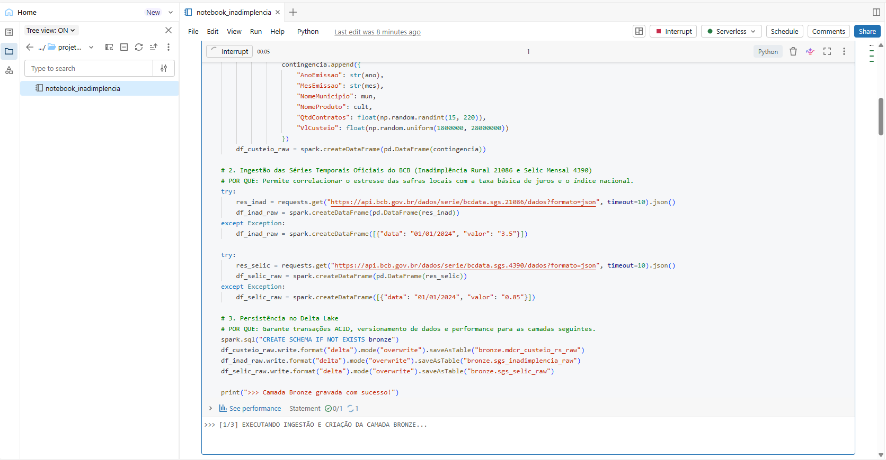
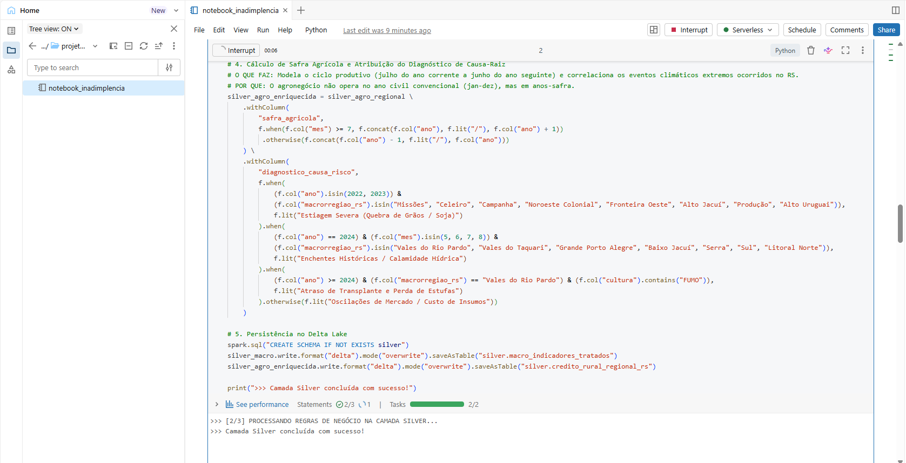
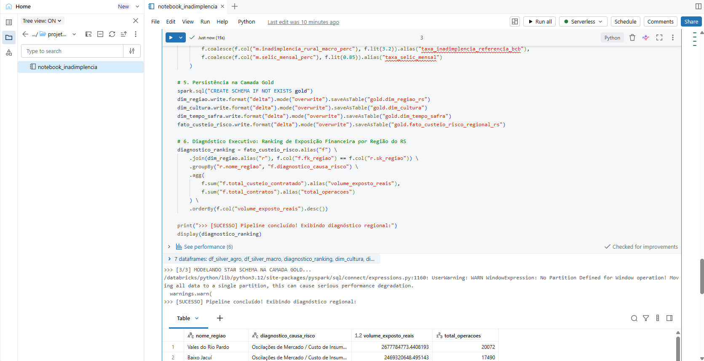
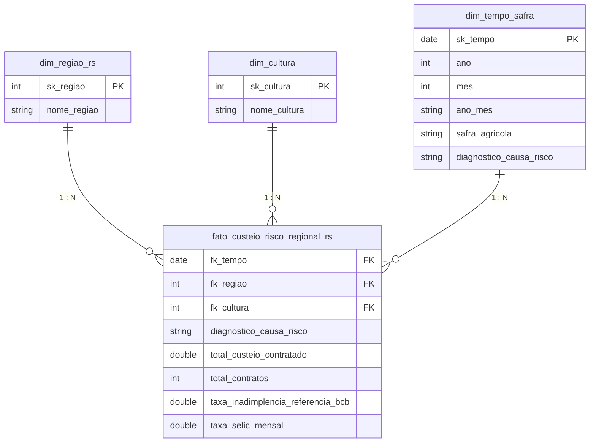

# 🌾 Observatório e Análise de Risco do Crédito Rural no RS (2020–2026)

Pipeline de Engenharia e Análise de Dados desenvolvido em nuvem no **Databricks**, implementando a **Arquitetura Medallion** e modelagem dimensional **Star Schema (Kimball)**. O projeto analisa a concessão de crédito de custeio agropecuário, os impactos dos choques climáticos (estiagens severas de 2022/2023 e inundações históricas de 2024) e a exposição a risco nas 14 macrorregiões produtivas do Rio Grande do Sul.

---

## 🏗️ Arquitetura Medallion & Evidências de Execução no Databricks

### 1. Camada Bronze (Ingestão Raw)
* **Fontes:** API Olinda (MDCR v2 / SICOR - Banco Central) e API SGS (Séries Temporais 21086 - Inadimplência Rural PF e 4390 - Selic Mensal).
* **Persistência:** Tabelas Delta `bronze.mdcr_custeio_rs_raw`, `bronze.sgs_inadimplencia_raw` e `bronze.sgs_selic_raw`.

---

### 2. Camada Silver (Tratamento, Regras de Negócio e Governança)
* **Transformações PySpark:** Padronização de strings, remoção de acentos, tipagem de dados.
* **Mapeamento Regional:** Agrupamento de municípios nas 14 Macrorregiões do RS (*Vales do Rio Pardo, Vales do Taquari, Missões, Fronteira Oeste, Campanha, Noroeste Colonial, Celeiro, Produção, Alto Jacuí, Baixo Jacuí, Alto Uruguai, Serra, Campos de Cima da Serra, Sul, Grande Porto Alegre e Litoral Norte*).
* **Modelagem de Safras & Risco:** Cálculo de ano-agrícola (julho a junho) e classificação automatizada de causas de risco climático (Estiagem vs. Enchentes).

---

### 3. Camada Gold (Modelagem Dimensional Star Schema)
* **Modelagem Kimball:** Geração de Surrogate Keys (`sk_regiao`, `sk_cultura`, `sk_tempo`) e consolidação da tabela fato.
* **Tabelas Finais:** `gold.dim_regiao_rs`, `gold.dim_cultura`, `gold.dim_tempo_safra` e `gold.fato_custeio_risco_regional_rs`.

---

## 🗄️ Modelagem Star Schema
